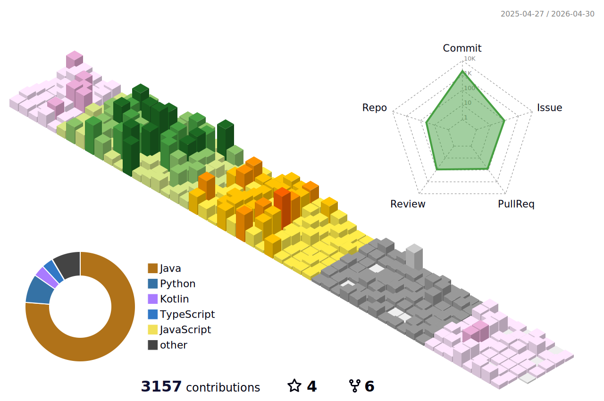

## 📌 About Me

  안녕하세요, codesche입니다. 
  입출력의 결과가 확실하게 나타나는 개발에 매력을 느껴 개발의 길을 걷고 있습니다.

<strong> 🔽 프로필 </strong>

- **Name**: Minsung Ha (하민성)  
- **Nickname**: codesche  
- **Email**: codesche@gmail.com

<strong> 🔽 발표 </strong>
 
내가 알고 있는 지식과 정보를 쉽게 전달하기 위해 노력합니다.
  
- [“Hello Atlassian, 기다려온 미래” 컨퍼런스 발표](https://dmove.tistory.com/entry/atlassian-event-240327)  
- [화이트보드 활용 가이드 (입문자 대상)](https://dmove.tistory.com/entry/atlassian-meetup-review-240118)  

<strong> 🔽 꾸준한 공부 </strong>

## 📚 학습 내용

<table>
  <thead>
    <tr>
      <th>카테고리</th>
      <th>학습 항목</th>
      <th>링크</th>
    </tr>
  </thead>
  <tbody>
    <tr>
      <td rowspan="3">프로그래밍 언어</td>
      <td>Java 알고리즘 스터디</td>
      <td><a href="https://github.com/codesche/2025-algo">GitHub</a></td>
    </tr>
    <tr>
      <td>Python 스터디</td>
      <td><a href="https://github.com/codesche/python-study">GitHub</a></td>
    </tr>
    <tr>
      <td>Kotlin 스터디</td>
      <td><a href="https://github.com/codesche/kotlin-study">GitHub</a></td>
    </tr>
    <tr>
      <td rowspan="2">인프라 / DevOps</td>
      <td>AWS에서 Jenkins 구축</td>
      <td><a href="https://chisel-girdle-b92.notion.site/EC2-Jenkins-237d2cee333480fda8daf143b5eb1cd6">Notion</a></td>
    </tr>
    <tr>
      <td>AWS에서 ELK + Prometheus + Grafana 구축</td>
      <td><a href="https://codesche.oopy.io/238de3f7-e3a8-803c-b23a-fdefe1262771">Blog</a></td>
    </tr>
    <tr>
      <td rowspan="2">소프트웨어 공학</td>
      <td>클린 코드</td>
      <td><a href="https://github.com/codesche/CleanCode-study">GitHub</a></td>
    </tr>
    <tr>
      <td>실습 코드 정리</td>
      <td><a href="https://github.com/codesche/exercise-code?tab=readme-ov-file">GitHub</a></td>
    </tr>
    <tr>
      <td rowspan="5">Spring / SpringBoot</td>
      <td>Spring Study</td>
      <td><a href="https://github.com/codesche/Spring-Summary">GitHub</a></td>
    </tr>
    <tr>
      <td>SpringBoot 활용한 나만의 블로그 만들기</td>
      <td><a href="https://github.com/codesche/springboot-miniblog">GitHub</a></td>
    </tr>
    <tr>
      <td>SpringBoot MSA 세팅 가이드</td>
      <td><a href="https://codesche.oopy.io/19dde3f7-e3a8-8016-be48-e0fc3babbab7">Blog</a></td>
    </tr>
    <tr>
      <td>SpringBoot Dirty Checking</td>
      <td><a href="https://codesche.oopy.io/1a3de3f7-e3a8-804c-ad7e-cce9029a9cd3">Blog</a></td>
    </tr>
    <tr>
      <td>SpringBoot + Thymeleaf 활용한 게시판 구현</td>
      <td><a href="https://github.com/codesche/BoardProject">GitHub</a></td>
    </tr>
    <tr>
      <td rowspan="2">프로젝트 / 실습</td>
      <td>프로그래밍 교육</td>
      <td><a href="https://github.com/codesche/2025-likelion-exercise">GitHub</a></td>
    </tr>
    <tr>
      <td>기본적인 게시판 구현</td>
      <td><a href="https://github.com/codesche/rest-api-project">GitHub</a></td>
    </tr>
  </tbody>
</table>

<strong>🔽 기술 스택</strong>

---

## ☕ Java
- 객체지향적인 설계를 바탕으로 유지보수성과 확장성이 뛰어난 코드를 작성하고자 노력합니다.
- 다형성, SOLID, 캡슐화 등 객체지향 프로그래밍에 대한 개념을 적용한 코드를 작성할 수 있습니다.
- Java의 컬렉션 프레임워크인 List, Map과 Stream API를 활용하여 가독성과 성능을 고려한 코드 최적화를 수행한 경험이 있습니다.
- jsoup을 활용하여 웹 페이지의 정보를 크롤링한 경험이 있습니다.

## 🚀 Spring Boot
- Spring Boot의 자동 설정과 내장 WAS인 Tomcat을 활용하여 어플리케이션을 구축할 수 있습니다.
- RESTful API 개발 시, Spring Web MVC와 DTO를 활용하여 유지보수성과 확장성을 고려한 구조를 설계한 경험이 있습니다.
- Profile 기능을 이용하여 `application.yml`에서 개발, 테스트, 운영 환경을 분리하여 프로젝트를 진행한 경험이 있습니다.
- 다양한 예외에 대해 적절한 HTTP 응답을 반환할 수 있는 코드를 작성하여 일관된 예외 처리 코드를 작성한 경험이 있습니다.
- SSE를 활용하여 이벤트 발생 시 사용자에게 실시간 알림 기능을 구현한 경험이 있습니다.
- Pageable 인터페이스를 활용하여 데이터의 정렬 기준, 페이지 크기 설정이 가능한 페이지네이션을 구현한 경험이 있습니다.

## 📦 Spring Data JPA
- JPA의 영속성 컨텍스트를 이해하고, 효율적인 데이터베이스 연산을 위한 연관관계 매핑과 Fetch 전략을 수립할 수 있습니다.
- 성능 개선을 위해 Fetch Join을 활용하여 N+1 문제를 해결한 경험이 있습니다.
- Dirty Checking을 활용하여 UPDATE 쿼리를 자동으로 실행하도록 구성하여 코드 가독성과 유지보수성, 성능 최적화를 달성한 경험이 있습니다.

## 🖥 Spring MVC
- Controller, Service, Repository 계층을 명확히 구분하여 유지보수성을 높이고, RESTful API 설계를 준수합니다.
- 요청과 응답 데이터를 DTO로 구조화하여 코드의 일관성을 유지할 수 있는 코드를 작성할 수 있습니다.

## 🔐 Spring Security
- JWT 및 OAuth2를 활용한 인증/인가 시스템을 구현하여 보안성이 보장된 소셜 로그인 기능을 구현할 수 있습니다.
- 세션 관리 및 CSRF, CORS 정책을 고려한 안전한 웹 애플리케이션을 개발합니다.

## ⚙️ Spring Batch
- 대량의 데이터를 처리할 수 있도록 Spring Batch를 활용하여 성능 최적화를 진행한 경험이 있습니다.
- Spring Scheduler를 활용하여 안정적인 배치 실행이 가능한 코드를 작성할 수 있습니다.
- Tasklet을 활용하여 불필요한 로그 및 기록을 특정 시간대에 삭제 처리한 경험이 있습니다.
- Chunk를 활용하여 OpenApi 호출 시 특정 시간대에 특정 갯수만큼의 데이터를 추가한 경험이 있습니다. 

## 🗄 Database (MySQL, Oracle, MSSQL, ElasticSearch)
- 성능 개선을 위한 서브 쿼리를 작성한 경험이 있습니다.
- DB와 어플리케이션을 연동하여 인프라 구축을 진행한 경험이 있습니다.
- JOIN과 GROUP BY를 활용하여 데이터 조회 성능 향상을 이끌어낸 경험이 있습니다.
- 데이터 무결성·정합성 에러 해결 및 DB 성능 개선 작업을 진행한 경험이 있습니다.
- ElasticSearhc를 활용하여 접두어 글자, 초성, 중간 글자 검색 및 오타가 포함된 키워드 검색 기능을 구현한 경험이 있습니다. 

## ⚡ Redis
- In-memory 기반인 Redis를 활용하여 조회 성능을 높이기 위해 캐싱을 활용한 경험이 있습니다.
- Spring Boot에서 Redis와 연동할 수 있는 설정을 할 수 있으며, AWS ElasticCache를 활용하여 Cloud 환경에서도 Redis를 사용한 경험이 있습니다.
- 채팅방 기능 구현을 위해 WebSocket과 STOMP 프로토콜을 활용하는 과정에서 Redis를 통해 발행/구독 기능을 구현한 경험이 있습니다.

## ☁️ AWS
### EC2
- EC2 Ubuntu 서버를 구축하여 SSH key를 통해 관리 및 운영한 경험이 있습니다.

### RDS
- MySQL RDS를 운영하며, 성능 최적화를 위해 Parameter Group을 조정한 경험이 있습니다.
- 자동 백업 및 스냅샷을 활용하여 안정적인 데이터 관리 수행.
- RDS와 Spring Boot 연동 경험.

### ElasticCache
- Redis 클러스터 생성 및 EC2 환경에서의 연결 설정 경험.

### Route53
- 가비아에서 도메인을 생성 후 네임서버를 적용하여 웹 사이트 구축을 진행한 경험이 있습니다.

## 🐳 Docker
- Docker Compose를 활용하여 다중 컨테이너 애플리케이션 관리 경험.
- Dockerfile 작성 및 빌드 경험.

## 🔧 Git & GitHub Actions
### Git
- Git Flow 전략을 활용한 협업 경험.
- GitHub Wiki, GitHub Project를 활용하여 효율적인 이슈 및 PR 관리.
- Issue 템플릿 표준화 및 작업 단위 관리.

### GitHub Actions
- CI/CD 파이프라인 구축하여 코드 변경 시 자동 테스트 및 배포.
- AWS 및 Docker와 연동한 자동화 배포 환경 구성.
- Slack Webhook 연동으로 배포 성공/실패 알람 설정.

## DevOps

### 🛠 Jenkins
- Jenkins를 활용한 CI/CD 환경 구축 및 Gradle 빌드 자동화.
- Webhook 기반 GitHub 연동.
- 파이프라인 스크립트 작성 및 Slack Webhook/Discord Webhook 알림 설정.

### 🖥️ Grafana & Prometheus
- Prometheus와 Grafana를 활용하여 JVM 메모리 현황 모니터링 구축.

### 🔦 ELK(ElasticSearch + LogStash + Kibana)
- SpringBoot 실행 시 관련 로그에 대한 실시간 모니터링 및 데이터 시각화 적용
- 인덱스를 통한 특정 키워드들 시각화하여 확인 가능하도록 구현 

## 🧪 JUnit5 & Mockito
- Mock 객체로 의존성 제거 및 BDD 스타일 테스트 작성.
- 단위 테스트, 통합 테스트로 코드 안정성 확보.

## 📋 협업 툴 (Jira, Confluence, Slack, Notion, Mattermost)
### Jira & Confluence
- 애자일 프로세스 기반 스프린트 관리 및 칸반 보드 활용.
- Confluence로 업무 일지 및 회의록 작성.

### Slack
- 프로젝트 커뮤니케이션 및 CI/CD 알림 기능 구현 경험.

### Notion & Mattermost
- Notion으로 프로젝트 문서 체계 관리 및 지식 공유.
- Mattermost로 실시간 팀 협업 경험.

---

 

## Career
- [2023.05 ~ 2024.05] [`Dmove`](https://www.dmove.co.kr/main) - Atlassian Solution Engineer
- [2020.03 ~ 2022.08] [`ACK`](https://www.ack.co.kr/) - LIS Interface Developer

 

## 💼 Work Experience

| 기간 | 회사 | 프로젝트 | 주요 내용 |
|:-------------:|:----------------:|-----------|-------------|
| 2023.11 ~ 2024.03 |`Dmove`| yanolja 클라우드 마이그레이션 | Jira, Confluence의 Data Center 버전의 데이터를 클라우드로 이관 (95% 이상 이관 성공) |
| 2022.04 ~ 2022.06 |`ACK` | 이기은진단검사의학과 코로나 검사 자동화 시스템 구축 | 코로나 검사 인터페이스 개발 (인터페이스와 전산시스템, DB와 연동하여 자동 검사 방식으로 변경) |
| 2022.05 ~ 2022.05 |`ACK` | 인천국제공항 제1터미널 코로나19 검사센터 검사 자동화 시스템 구축 | 코로나 검사 인터페이스 개발 (검사 파일 양식을 파싱하여 전산에 결과 등록할 수 있는 작업 진행) |
| 2022.02 ~ 2022.03 |`ACK` | 울산중앙병원 신관 전산시스템 구축| 혈액, 미생물, 뇨화학 파트 진단검사 장비 인터페이스 개발 |
| 2020.12 ~ 2021.04 |`ACK` | 의정부을지병원 차세대 전산 구축 프로젝트|SmartQC 연동 및 설치 + 진단검사장비 인터페이스 개발 |

 

## 🛠 Skills

|**Category**             | **Skills**                                                                 |
|:--------------------------:|----------------------------------------------------------------------------|
| **Backend**              | Java, Spring Boot, Spring Data JPA, QueryDSL, Spring Batch, WebSocket, SSE, Gradle, Maven |
| **Frontend**             | HTML, CSS, JavaScript |
| **Database**             | MySQL, Oracle, PostgreSQL, Redis, Valkey, MongoDB, ElasticSearch                                                    |
| **Server / DevOps**      | AWS EC2, AWS RDS, AWS ElasticCache, Docker, Grafana, Prometheus, GitHub Actions, Jenkins          |
| **Tools / Test Code**    | IntelliJ IDEA, Visual Studio Code, JUnit5, Mockito                          |
| **Operating System**     | Ubuntu 22.04 LTS, Rocky Linux 8, CentOS 7                                           |
| **Collaboration Tools**  | Git, Jira, Slack, Notion, Mattermost, Discode                                      |

 

## 🛠 Projects
- **TRPG 게임 DungeonTalk** (2025.07 ~ 2025.08) [링크](https://github.com/DungeonTalk/dungeontalk-backend/wiki)
- **감정 기반 도서 추천 서비스** (2025.07 ~ 2025.07) [링크](https://github.com/moodbook-space)
- **개발자의 자기계발을 위한 문제 공유 서비스** (2024.10 ~ 2024.11) [링크](https://github.com/DoDreamTeam/Backend/wiki)
- **맞춤형 정보 조회 서비스** (2023.01 ~ 2023.03) [링크](https://github.com/Lazy-Board)

 

## 🎤 Presentation & Experience
- [“Hello Atlassian, 기다려온 미래” 컨퍼런스 발표](https://dmove.tistory.com/entry/atlassian-event-240327)  
- [화이트보드 활용 가이드 (입문자 대상)](https://dmove.tistory.com/entry/atlassian-meetup-review-240118)  
- [2015 국회의장배 스피치·토론대회 참가](https://www.icouncil.kr/news/articleView.html?idxno=28760)  

 

## 🎓 Education & Training
| 기간 | 과정명 | 성과 |
|------|--------|------|
| 2025.06 ~ 2025.08 | 멋쟁이사자처럼 백엔드 단기 심화 과정 | 진행 중 |
| 2024.06 ~ 2024.11 | KOSTA Java Cloud 백엔드 과정 | [DoDream 최우수 프로젝트, 우수 훈련생](https://kostaswedu.co.kr/32/?q=YToyOntzOjEyOiJrZXl3b3JkX3R5cGUiO3M6MzoiYWxsIjtzOjQ6InBhZ2UiO2k6Mzt9&bmode=view&idx=127604592&t=board) |
| 2022.09 ~ 2023.03 | 제로베이스 백엔드 개발자 교육 | [Lazier 5기 백엔드 스쿨 최우수 프로젝트](https://github.com/Lazy-Board/.github) |
| 2019.09 ~ 2020.01 | 경기산업기술교육센터 IoT 교육 | 경기도지사 상, 중간평가 최우수상, [I‑HOME 프로젝트](https://sniper4366.wixsite.com/smartunity) |
| 2012.03 ~ 2018.02 | 동양미래대학교 로봇공학과 | 졸업 |

 

## 🏅 Certificate
| 기간 | 성과 |
|------|--------|
| 2025.06 | 정보처리기사 필기 합격, 한국산업인력공단 |
| 2024.10 | 리눅스마스터 2급, 한국정보통신진흥협회(KAIT) |
| 2023.06 | ITIL v4 foundation, PeopleCert |
| 2022.12 | SQLD, 한국데이터산업진흥원 |

 

## 🏆 Awards
| 기간 | 내용 |
|------|--------|
| 2017.12 | 교내 도서관 문화행사 하반기 최다 다독상 수상 |
| 2017.06 | 교내 도서관 문화행사 상반기 최다 다독상 수상 |
| 2015.07 | 국회의장배 ‘인성’ 스피치 대회 전국 예선 진출 |

 

## 🌈 Github Commit Record

 

## ⚡️ GitHub stats

 

## 🚴🏻‍♂️ solved.ac

 

## 🧑🏻‍💻 Tech Blog & Contact

  &nbsp&nbsp
  

