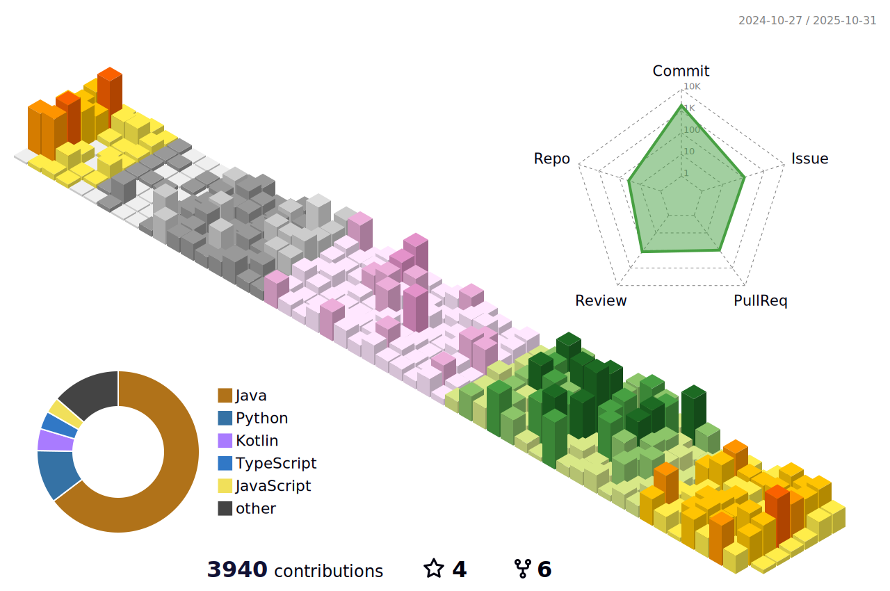

## 📌 About Me

  안녕하세요, 개발자 codesche입니다. 
  입출력의 결과가 확실하게 나타나는 개발에 매력을 느껴 개발의 길을 걷고 있습니다.

<strong> 🔽 프로필 </strong>

- **Name**: Minsung Ha (하민성)  
- **Nickname**: codesche  
- **Email**: codesche@gmail.com

<strong> 🔽 발표 </strong>
 
내가 알고 있는 지식과 정보를 쉽게 전달하기 위해 노력합니다.
  
- [“Hello Atlassian, 기다려온 미래” 컨퍼런스 발표](https://dmove.tistory.com/entry/atlassian-event-240327)  
- [화이트보드 활용 가이드 (입문자 대상)](https://dmove.tistory.com/entry/atlassian-meetup-review-240118)  

<strong> 🔽 꾸준한 공부 </strong>

- [Java 알고리즘 스터디](https://github.com/codesche/2025-algo)
- [Python 스터디](https://github.com/codesche/python-study)
- [Kotlin 스터디](https://github.com/codesche/kotlin-study)
- [AWS에서 Jenkins 구축](https://chisel-girdle-b92.notion.site/EC2-Jenkins-237d2cee333480fda8daf143b5eb1cd6)
- [AWS에서 ELK + Prometheus + Grafan 구축](https://codesche.oopy.io/238de3f7-e3a8-803c-b23a-fdefe1262771)
- [클린 코드](https://github.com/codesche/CleanCode-study)
- [실습 코드 정리](https://github.com/codesche/exercise-code?tab=readme-ov-file)
- [Spring Study](https://github.com/codesche/Spring-Summary)
- [SpringBoot 활용한 나만의 블로그 만들기](https://github.com/codesche/springboot-miniblog)
- [Side Project](https://github.com/codesche/BoardProject)
- [프로그래밍 교육](https://github.com/codesche/2025-likelion-exercise)
- [기본적인 게시판 구현](https://github.com/codesche/rest-api-project)

 

## Career
- [2023.05 ~ 2024.05] [`Dmove`](https://www.dmove.co.kr/main) - Atlassian Solution Engineer
- [2020.03 ~ 2022.08] [`ACK`](https://www.ack.co.kr/) - LIS Interface Developer

 

## 💼 Work Experience

| 기간 | 회사 | 프로젝트 | 주요 내용 |
|:-------------:|:----------------:|-----------|-------------|
| 2023.11 ~ 2024.03 |`Dmove`| 야놀자 아틀라시안 클라우드 마이그레이션 | Jira, Confluence 데이터를 클라우드로 이관 |
| 2022.04 ~ 2022.06 |`ACK` | 이기은진단검사의학과 코로나 검사 자동화 시스템 구축 | 코로나 검사 인터페이스 개발 |
| 2022.05 ~ 2022.05 |`ACK` | 인천국제공항 제1터미널 코로나19 검사센터 검사 자동화 시스템 구축 | 코로나 검사 인터페이스 개발 |
| 2022.02 ~ 2022.03 |`ACK` | 울산중앙병원 신관 전산시스템 구축| 신관 오픈 진단검사 장비 인터페이스 개발 |
| 2020.12 ~ 2021.04 |`ACK` | 의정부을지병원 차세대 전산 구축 프로젝트|SmartQC 연동 및 설치 + 진단검사장비 인터페이스 개발 |

 

## 🛠 Skills

| **Category**             | **Skills**                                                                 |
|--------------------------|----------------------------------------------------------------------------|
| **Backend**              | Java, Spring Boot, Spring Data JPA, QueryDSL, Spring Batch, Gradle, Maven |
| **Frontend**             | HTML, CSS, JavaScript, React |
| **Database**             | MySQL, Oracle, PostgreSQL, Redis, MongoDB, ElasticSearch                                                      |
| **Server / DevOps**      | AWS EC2, AWS RDS, AWS ElasticCache, Docker, Grafana, Prometheus, GitHub Actions, Jenkins          |
| **Tools / Test Code**    | IntelliJ IDEA, VS Code, JUnit5, Mockito                          |
| **Operating System**     | Ubuntu 22.04 LTS, Rocky Linux 8, CentOS 7                                           |
| **Collaboration Tools**  | Git, Jira, Slack, Notion, Mattermost                                      |

 

## 🛠 Projects
- **개발자의 자기계발을 위한 문제 공유 서비스** (2024.10 ~ 2024.11) [링크](https://github.com/DoDreamTeam/Backend/wiki)
- **맞춤형 정보 조회 서비스** (2023.01 ~ 2023.03) [링크](https://github.com/Lazy-Board)

 

## 🎤 Presentation & Experience
- [“Hello Atlassian, 기다려온 미래” 컨퍼런스 발표](https://dmove.tistory.com/entry/atlassian-event-240327)  
- [화이트보드 활용 가이드 (입문자 대상)](https://dmove.tistory.com/entry/atlassian-meetup-review-240118)  
- [2015 국회의장배 스피치·토론대회 참가](https://www.icouncil.kr/news/articleView.html?idxno=28760)  

 

## 🎓 Education & Training
| 기간 | 과정명 | 성과 |
|------|--------|------|
| 2025.06 ~ 2025.08 | 멋쟁이사자처럼 백엔드 단기 심화 과정 | 진행 중 |
| 2024.06 ~ 2024.11 | KOSTA Java Cloud 백엔드 과정 | [DoDream 최우수 프로젝트, 우수 훈련생](https://kostaswedu.co.kr/32/?q=YToyOntzOjEyOiJrZXl3b3JkX3R5cGUiO3M6MzoiYWxsIjtzOjQ6InBhZ2UiO2k6Mzt9&bmode=view&idx=127604592&t=board) |
| 2022.09 ~ 2023.03 | 제로베이스 백엔드 개발자 교육 | [Lazier 5기 백엔드 스쿨 최우수 프로젝트](https://zero-base.oopy.io/be_project_2408) |
| 2019.09 ~ 2020.01 | 경기산업기술교육센터 IoT 교육 | 경기도지사 상, 중간평가 최우수상 [I‑HOME 프로젝트](https://sniper4366.wixsite.com/smartunity) |

 

## 🏅 Certificate
| 기간 | 성과 |
|------|--------|
| 2025.06 | 정보처리기사 필기 합격, 한국산업인력공단 |
| 2024.10 | 리눅스마스터 2급, 한국정보통신진흥협회(KAIT) |
| 2023.06 | ITIL v4 foundation, PeopleCert |
| 2022.12 | SQLD, 한국데이터산업진흥원 |

 

## 🏆 Awards
| 기간 | 내용 |
|------|--------|
| 2017.12 | 교내 도서관 문화행사 하반기 최다 다독상 수상 |
| 2017.06 | 교내 도서관 문화행사 상반기 최다 다독상 수상 |
| 2015.07 | 국회의장배 ‘인성’ 스피치 대회 전국 예선 진출 |

 

## ⚡️ GitHub stats

 

## 🚴🏻‍♂️ BaekJoon

 

## 🧑🏻‍💻 Tech Blog & Contact

  &nbsp&nbsp
  

 

## 🌈 Github Commit Record

